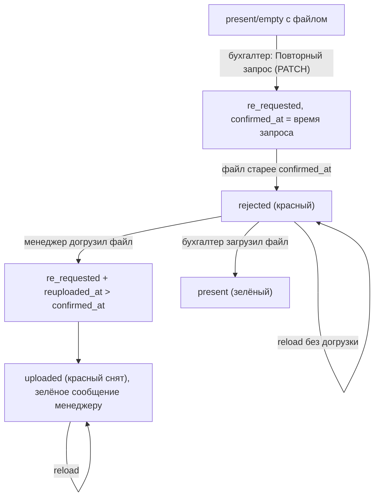

# Закрывающие документы: статусы, подсветка и права

Документ описывает логику работы с закрывающими документами на этапе
`documents_confirmed`: какие бывают статусы, как подсвечиваются поля файлов,
кто и когда может загружать/менять файл, и как это связано с контрактом бэкенда.

Логика покрыта тестами-спецификацией:

- [stage-document-variant.test.ts](../src/entities/project-documents/lib/stage-document-variant.test.ts) — подсветка поля;
- [document-upload-permissions.test.ts](../src/widgets/project-stage-section/lib/document-upload-permissions.test.ts) — права на загрузку/замену;
- [get-document-upload-error-message.test.ts](../src/features/stage-document/lib/get-document-upload-error-message.test.ts) — текст ошибки загрузки.

## Действующие лица

- **Менеджер** (`manager`) — собирает и загружает закрывающие документы.
- **Бухгалтер** (`accountant`) — проверяет документы и проставляет статус.
  Имеет приоритет: подтверждённый им документ менеджер уже не трогает.

## Типы документов

Три слота (см. `STAGE_DOCUMENTS` в
[stage-document-registry.ts](../src/entities/project-documents/lib/stage-document-registry.ts)):

| `documentType`    | Описание                 |
| ----------------- | ------------------------ |
| `project_closing` | Закрывающие по проекту   |
| `subrent_closing` | Закрывающие по субаренде |
| `staff_receipts`  | Расписки по персоналу    |

## Статусы документа

| Статус         | Метка в UI         | Смысл                                                   |
| -------------- | ------------------ | ------------------------------------------------------- |
| `present`      | «Есть»             | Документ принят бухгалтером.                            |
| `not_required` | «Не требуется»     | Документ не нужен.                                      |
| `re_requested` | «Повторный запрос» | Бухгалтер запросил документ повторно, ждём свежий файл. |
| _не выставлен_ | —                  | Бухгалтер ещё не оценивал документ.                     |

Статус выставляет бухгалтер селектом (PATCH `documents`) либо он проставляется
сервером автоматически при загрузке файла бухгалтером (см. ниже).

## Контракт бэкенда

`GET /projects/:id/` отдаёт массив `documents[]` (`ProjectDocumentStatus`), где для
каждого типа есть:

- `status` — текущий статус;
- `confirmed_at` — время последнего действия бухгалтера по статусу. **При
  `re_requested` это время повторного запроса** — ключевая точка отсчёта;
- `reuploaded_at` — время повторной загрузки файла менеджером после `re_requested`;
- `confirmed_by` — кто менял статус;
- `file` (`ProjectDocumentFile`) — `file_name`, `file_url`, `uploaded_at`, `uploaded_by`.

`POST /projects/:id/document-file/:document_type/` — загрузка/замена файла:

- при замене файла обновляется `file.uploaded_at`;
- **загрузка бухгалтером** переводит статус в `present` (серверно);
- **загрузка менеджером при `re_requested`** оставляет `re_requested`, выставляет
  `reuploaded_at` и уведомляет бухгалтерию.

> Эти серверные правила означают, что фронту не нужно отдельно PATCH-ить статус
> при загрузке бухгалтером и не нужно хранить «факт повторной загрузки» на клиенте.

## Подсветка поля файла

За цвет отвечает `getStageDocumentFieldVariant(fileName, status, meta)`
([stage-document-variant.ts](../src/entities/project-documents/lib/stage-document-variant.ts)).
Возвращает один из вариантов:

| Вариант     | Цвет        | Когда                                                                     |
| ----------- | ----------- | ------------------------------------------------------------------------- |
| `empty`     | нейтральный | Файла нет, статус не `re_requested`.                                      |
| `uploaded`  | серый       | Файл есть, статус не подтверждён (или догружен после повторного запроса). |
| `confirmed` | зелёный     | `present` + есть файл.                                                    |
| `rejected`  | красный     | `re_requested`, и свежего файла после запроса ещё нет.                    |

Решение «красный или нет» в `re_requested` принимается по времени
(`isUploadedAfterReRequest`): файл считается догруженным после повторного запроса,
если **`uploaded_at` ИЛИ `reuploaded_at` не раньше `confirmed_at`** (граница
включительна). Если `confirmed_at` нет — доказать догрузку нельзя, поле красное.

`meta` для расчёта собирается из:

- `uploadedAt` — `documentFiles[type].uploadedAt` (с бэка);
- `confirmedAt` — `*ConfirmedAt` из значений этапа (с бэка);
- `reuploadedAt` — `documentFiles[type].reuploadedAt` (с бэка).

Подсветка считается одинаково и у менеджера, и у бухгалтера — это чистая функция
от данных, без привязки к роли.

### Поток статуса «Повторный запрос»

## Права на загрузку/замену файла

`isDocumentUploadLocked(role, status, fieldEditable)`
([document-upload-permissions.ts](../src/widgets/project-stage-section/lib/document-upload-permissions.ts))
возвращает `true`, если загрузка/замена недоступна. Скачивание файла по клику от
этой блокировки не зависит и доступно всегда.

| Статус         | Менеджер                          | Бухгалтер          |
| -------------- | --------------------------------- | ------------------ |
| не выставлен   | можно                             | можно              |
| `re_requested` | можно                             | можно              |
| `present`      | **нельзя** (приоритет бухгалтера) | можно (перезалить) |
| `not_required` | нельзя                            | нельзя             |
| поле read-only | нельзя                            | нельзя             |

В компоненте `StageDocumentField`
([stage-document-field.tsx](../src/features/stage-document/ui/stage-document-field.tsx))
сама кнопка/замена управляется только пропом `disabled` — компонент не «зашивает»
запрет по варианту `confirmed`, поэтому бухгалтер может заменить даже зелёный файл.

## Поведение по ролям (итоговое)

- **Бухгалтер загружает файл** → статус автоматически `present` (серверно), поля
  даты/автора (`confirmed_at`/`confirmed_by`) приходят с бэка после рефетча; локально
  делается оптимистичный апдейт формы в `present`.
- **Статус «Есть»** → поле зелёное у обеих ролей.
- **Статус «Не требуется»** → замена выключена у обеих ролей; скачать можно.
- **Статус «Повторный запрос»** → поле красное (если файл был), у обеих ролей;
  краснота переживает reload, пока файл не догружен.
- **Менеджер догрузил файл при «Повторный запрос»** → красный снимается (через
  серверный `reuploaded_at`/`uploaded_at`) и держится после reload; показывается
  зелёное сообщение «Обновлённые документы направлены бухгалтеру».
- **Бухгалтер догрузил файл при «Повторный запрос»** → статус становится `present`.
- **Менеджер при «Есть»** → менять файл нельзя (приоритет бухгалтера).

## Поток данных на фронте

1. `GET /projects/:id/` → `mapBackendProjectDetail`
   ([from-backend.ts](../src/entities/project/lib/from-backend.ts)) раскладывает
   `documents[]` в:
   - значения этапа (`*Status`, `*ConfirmedAt`, `*ConfirmedBy`, `*FileName`);
   - `documentFiles[type]` со `uploadedAt`, `uploadedBy`, `reuploadedAt`.
2. Виджет `StageSectionCurrent`
   ([stage-section-current.tsx](../src/widgets/project-stage-section/ui/stage-section-current.tsx))
   считает `variant` и `disabled`, рендерит `StageDocumentField`.
3. **Загрузка файла** — `useUploadStageDocument`
   ([use-upload-stage-document.ts](../src/features/stage-document/model/use-upload-stage-document.ts)):
   в `onSuccess` свежий `ProjectDetail` кладётся в кэш (`setQueryData`) — подсветка
   пересчитывается оптимистично, без ожидания рефетча — затем инвалидация.
4. **Смена статуса** — `useUpdateDocumentStatus`
   ([use-update-document-status.ts](../src/features/update-document-status/model/use-update-document-status.ts)):
   PATCH `documents` + инвалидация кэша проекта.

> Историческая заметка: ранее факт повторной загрузки хранился в `sessionStorage`
> (клиентский «костыль»), потому что бэкенд не отдавал `reuploaded_at`. Сейчас поле
> приходит с сервера, и весь клиентский трекер удалён — источник правды один.
